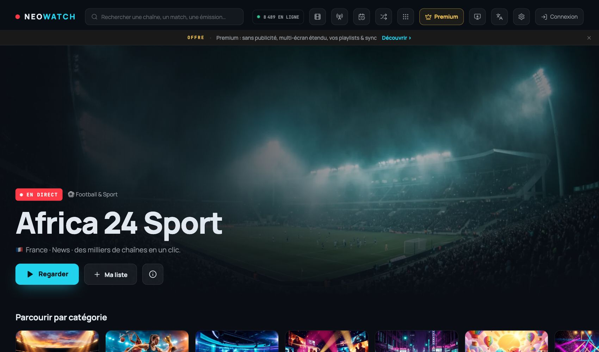
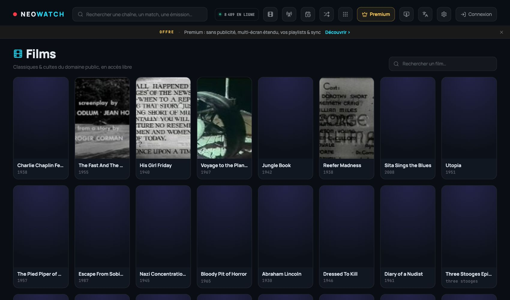
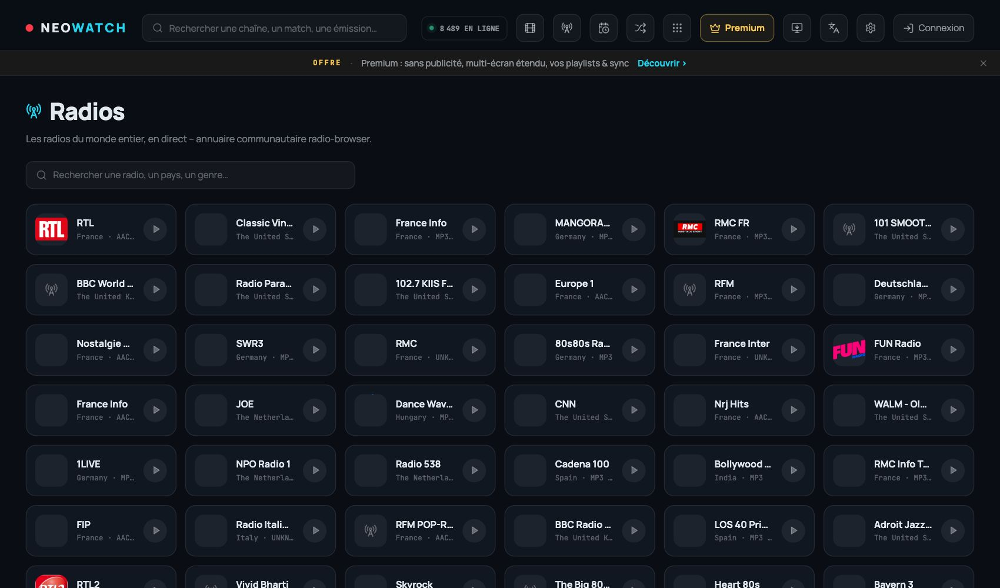
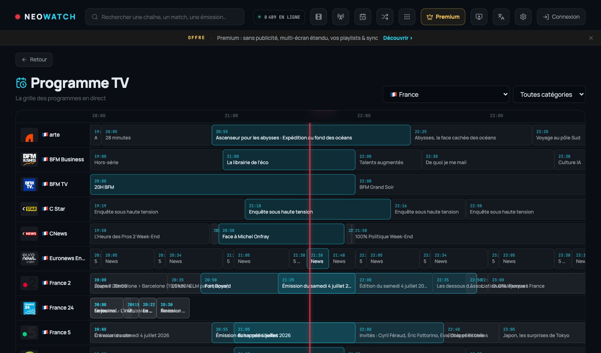
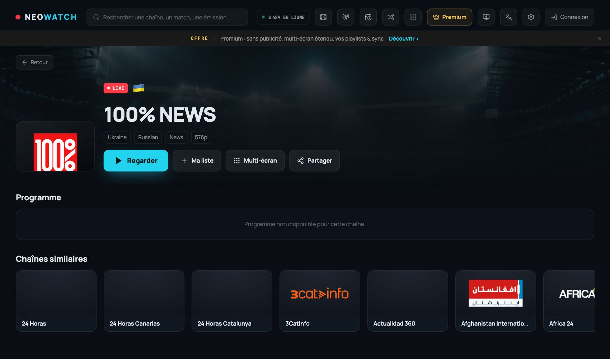

<div align="center">

# 📺 NEOWATCH

### The self-hostable, worldwide free live-TV, radio & public-domain-film aggregator.

Thousands of the world's freely-available live channels, internet radio and public-domain movies — in one fast, installable app with an HLS player, a multi-screen mosaic, a TV guide, and a full SaaS layer. **Every channel is free.**

[](https://neowatch.soclose.co)
[](LICENSE)
[](https://neowatch.soclose.co)


**[▶ Live demo](https://neowatch.soclose.co)** · [Features](#-features) · [Quick start](#-quick-start) · [Architecture](#-architecture) · [Legal model](#-legal--content-model) · [Contributing](CONTRIBUTING.md)

<br>

<a href="https://neowatch.soclose.co"></a>

### 👉 Try it live: **[neowatch.soclose.co](https://neowatch.soclose.co)**

</div>

---

## What is NEOWATCH?

NEOWATCH is an **aggregator and player** for publicly-available media. It hosts no content: it indexes and plays streams that broadcasters already publish openly — live TV from the [iptv-org](https://github.com/iptv-org/iptv) directory, internet radio from [radio-browser](https://www.radio-browser.info), and public-domain films from the [Internet Archive](https://archive.org). It ships as a fast React PWA backed by a thin Node/Express API, deployable as a single process on a small VPS.

It's built to be **used on anything** — phone, desktop, and especially the TV (D-pad/remote navigation, installable APK) — and to stay **fast and lawful**: direct-first playback keeps host bandwidth low, and monetization sells *features*, never access to third-party content.

## ✨ Features

**Content**
- 🌍 **~12,000 live channels** worldwide (every iptv-org category), normalized with logos, country, language, quality — **all free to watch**.
- 📻 **Internet radio** — 800+ stations from the radio-browser directory, with a sticky audio player.
- 🎬 **Public-domain films** — a browsable VOD catalog from the Internet Archive (classics, cult, documentaries), played natively.
- 📅 **TV guide (EPG)** — import an XMLTV source for now/next per channel + "search by programme".

**Player**
- ⚡ **Tuned hls.js** — fast start, adaptive bitrate, low latency; YouTube embed support.
- 🔁 **Resilient playback** — automatic escalation: direct → proxy → alternate feed, with a stall watchdog. A dead primary feed auto-promotes to a working alternate.
- 🎚️ **Quality, audio-language & subtitle** selection; Picture-in-Picture; fullscreen.
- 🟢 **Honest LIVE badges** — a background health sweep does a *real segment download* so "online" means it actually plays, not just that a manifest responds.

**Experience**
- 🪟 **Multi-screen mosaic** — watch 1–9 channels at once (great for following several matches), audio on one, config roams across devices.
- 🔎 **Relevance-ranked search** — multi-word, accent-insensitive, best-name-match first, with recent-search suggestions.
- 📱 **Installable PWA** + **Android TV APK** — responsive, offline shell, full keyboard/D-pad navigation.
- 📲 **QR sign-in** — scan a code on the TV to log in from your phone (no remote typing).
- 🌐 **i18n** — complete French / English / Russian.
- 🎨 Themes, accent colors, grid density, favorites & history.

**SaaS layer**
- 🔐 JWT auth, `admin`/`user` roles, admin dashboard (users, catalog refresh, health, takedown blocklist).
- 💳 **Freemium done right** — every channel is free; Premium sells *features* (no ads, extended multi-screen, cross-device sync, your own M3U playlists, personalized EPG). Mock billing built-in, **Stripe-ready** (checkout + signed webhook).
- 🛡️ Security-first — SSRF guard on every user-URL path, rate-limiting, atomic writes, signed proxy URLs, GDPR account deletion, legal pages.

## 🖼️ Screenshots

<i>Click any shot to open the live app → **[neowatch.soclose.co](https://neowatch.soclose.co)**</i>

<table>
  <tr>
    <td width="50%"><a href="https://neowatch.soclose.co/films"></a><br><sub><b>🎬 Films</b> — public-domain VOD</sub></td>
    <td width="50%"><a href="https://neowatch.soclose.co/radios"></a><br><sub><b>📻 Radio</b> — 800+ live stations</sub></td>
  </tr>
  <tr>
    <td width="50%"><a href="https://neowatch.soclose.co/programme-tv"></a><br><sub><b>📅 TV guide</b> — now/next EPG</sub></td>
    <td width="50%"><a href="https://neowatch.soclose.co"></a><br><sub><b>📺 Channel page</b> — details + programme</sub></td>
  </tr>
</table>

Brand & social assets live in [`web/public/social/`](web/public/social).

## 🏗️ Architecture

Monorepo (npm workspaces):

```
server/   Node 20 (ESM) · Express 4 — API, HLS proxy, catalog cache, auth, EPG, billing
web/      React 18 · Vite 6 · Tailwind 3 · Zustand 5 · hls.js — SPA / PWA
```

- **Dev:** Vite on `:5273`, API on `:8787` (Vite proxies `/api`).
- **Prod:** `npm run build` → `web/dist`; Express serves the static bundle **and** `/api` on a single port.
- **Data:** the iptv-org API is fetched and cached to disk with a TTL, normalized once in memory, then queried/paginated per request. No database — JSON-file persistence for users.
- **Playback:** the app plays **direct-first** and only falls back to the built-in HLS proxy for CORS/geo/mixed-content streams — keeping host bandwidth low on shared deploys.

Detailed module map: [`CLAUDE.md`](CLAUDE.md).

## 🚀 Quick start

```bash
npm install       # installs both workspaces
npm run dev       # web → http://localhost:5273 · api → http://localhost:8787
```

On first boot the server caches the iptv-org catalog (a few seconds) and creates an **admin** account — the email and a random password are printed **once** in the logs (pin them via `.env`).

### Production (single process)

```bash
npm run build     # typecheck + build the SPA into web/dist
npm start         # Express serves web/dist + /api on $PORT (8787)
```

### Docker

```bash
docker compose up --build -d
```

## ⚙️ Configuration

Copy `.env.example` → `.env`. Key variables (see the example file for the full list):

| Variable | Default | Purpose |
|---|---|---|
| `PORT` | `8787` | Server port |
| `CATALOG_TTL_HOURS` | `12` | Catalog cache lifetime |
| `HIDE_NSFW` | `true` | Hide adult channels |
| `REQUIRE_AUTH` | `false` | `true` = account required to watch (SaaS mode) |
| `JWT_SECRET` | *(dev auto)* | **Set a long random value in production** |
| `HEALTH_SWEEP` | `false` | Background availability sweep |
| `BILLING_PROVIDER` | `mock` | `mock` (instant) or `stripe` |
| `STRIPE_SECRET` / `STRIPE_PRICE_ID` / `STRIPE_WEBHOOK_SECRET` | — | Real payments (leave empty to use mock) |
| `ALLOWED_ORIGINS` | — | CORS allowlist for a deployed instance |

> **No secrets are committed.** `.env`, user data, caches and signing material are git-ignored. `.env.example` contains only empty placeholders.

## 🧭 Verify it works

```bash
curl localhost:8787/api/health                       # { ok: true }
curl "localhost:8787/api/catalog/meta"               # non-zero "total"
curl "localhost:8787/api/catalog/channels?category=sports&limit=3"
npm run typecheck && npm run build                   # must pass
```

There's also an integration suite (`tasks/integration-test.mjs`) and an end-to-end smoke test (`tasks/e2e-smoke.mjs`).

## ⚖️ Legal & content model

NEOWATCH is designed to be run lawfully:

- **It hosts nothing.** It indexes streams that are already publicly published and plays them from their source. Radios (radio-browser) and films (Internet Archive public domain) are curated, freely-redistributable directories.
- **Monetization sells features, not content.** Every channel is free to watch. Premium unlocks *software features* (no ads, extended multi-screen, sync, your own playlists, EPG) — never access to third-party content.
- **Instant takedown.** An operator can hide any stream immediately via the admin **blocklist** (`/api/admin/blocklist`) — the standard mechanism for honoring a rights-holder request.
- **Do not** add scrapers for paywalled or pirated content, and don't place ads next to third-party live streams.

Availability, quality and licensing of individual third-party streams are the responsibility of their broadcasters. Rights-holders can request removal via the contact in the app's legal page.

## 🤝 Contributing

Contributions are welcome — see [CONTRIBUTING.md](CONTRIBUTING.md). Found a security issue? See [SECURITY.md](SECURITY.md).

## 📄 License

[MIT](LICENSE) © SoClose Society. Built by the SoClose dev community.

<div align="center"><sub>NEOWATCH aggregates publicly-available free streams. It is not affiliated with any broadcaster.</sub></div>
