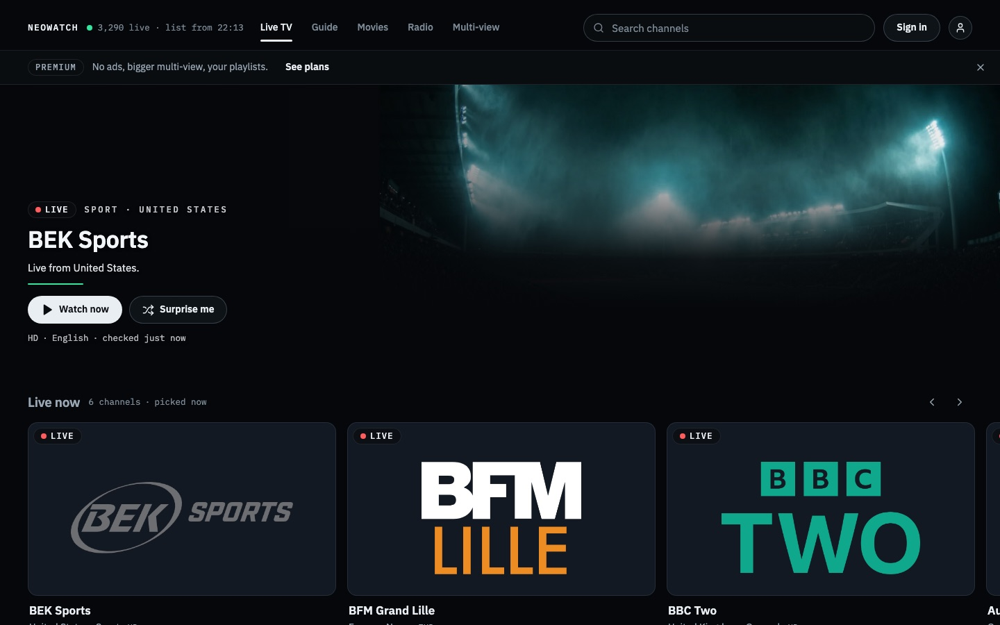
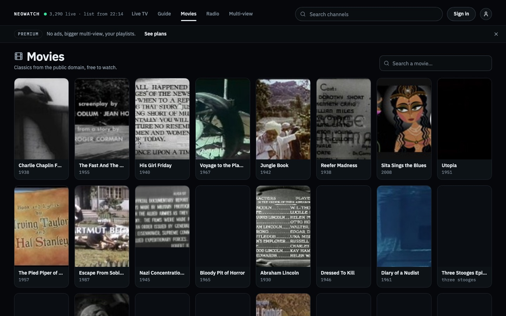
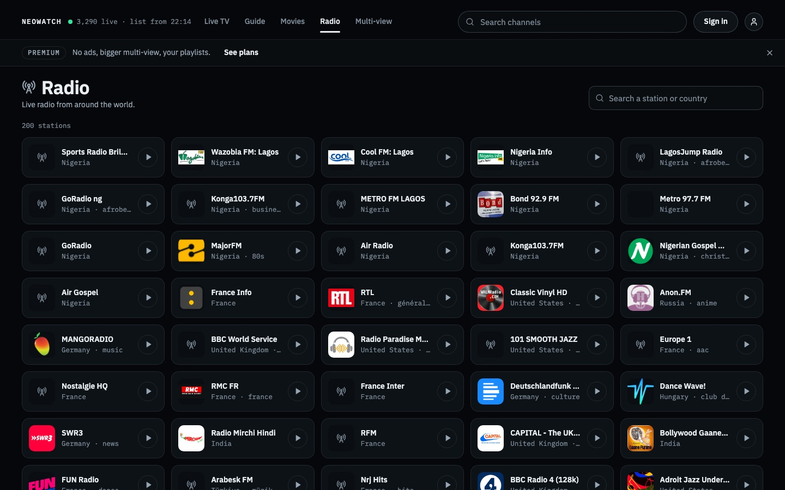
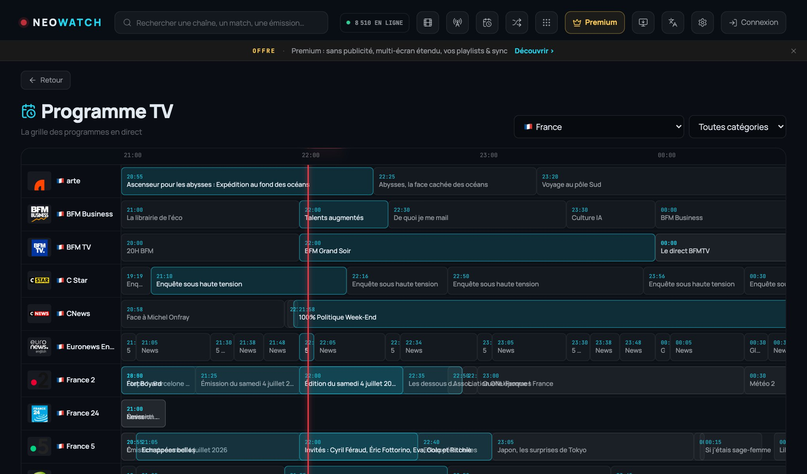
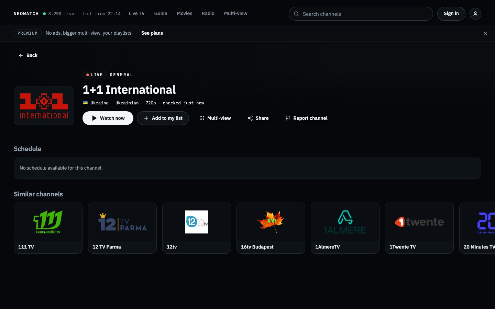

<div align="center">

# NEOWATCH

### Self-hostable live TV, radio and public-domain films, in one fast app.

About 12,000 of the world's freely published live channels, internet radio and public-domain movies, with a fast player, a 9-screen mosaic, a TV guide and a remote-friendly TV layout. **Every channel is free.**

[](https://neowatch.soclose.co)
[](LICENSE)


**[Live demo](https://neowatch.soclose.co)** · [Features](#features) · [Quick start](#quick-start) · [Tests](#tests) · [Deploy](#deploy) · [Legal model](#legal-and-content-model) · [Contributing](CONTRIBUTING.md)

<br>

<a href="https://neowatch.soclose.co"></a>

</div>

---

## What is NEOWATCH?

NEOWATCH is an **aggregator and player** for publicly available media. It hosts no content: it indexes and plays streams that broadcasters already publish openly. Live TV comes from the [iptv-org](https://github.com/iptv-org/iptv) directory, internet radio from [radio-browser](https://www.radio-browser.info), and public-domain films from the [Internet Archive](https://archive.org). It ships as a React PWA backed by a thin Node/Express API, deployable as one process on a small VPS.

It is built for every screen: phone, desktop and above all the TV (D-pad navigation, a Back key that always does the right thing, an Android TV app). It stays **fast and lawful**: playback is direct-first so the host serves mostly JSON, and Premium sells *features*, never access to third-party content.

## Features

**Content**
- About **12,000 live channels** worldwide, every iptv-org category, with logos, country, language and quality. All free to watch.
- **Internet radio** from the radio-browser directory, with a sticky audio player.
- **Public-domain films** from the Internet Archive, played natively.
- **TV guide**: now/next on cards and channel pages, a day grid at `/programme-tv`, and programme search (XMLTV sources).

**Player**
- Tuned hls.js: fast start, adaptive bitrate, low latency; YouTube embeds.
- Resilient: direct first, then the built-in proxy, then the channel's alternate feeds, with a stall watchdog. A dead primary feed is replaced by a working alternate.
- Quality, audio language and subtitles when the stream carries them; Picture-in-Picture; fullscreen.
- Honest LIVE badges: a background sweep downloads a real segment, and every verdict carries its age ("checked 5 min ago").

**Experience**
- Design: the Sentinel House "Lunaire" language (dark, IBM Plex, one primary action per screen, a visible focus ring on every control, text never under 12 px).
- **Multi-view mosaic**: up to 9 channels at once, sound on one, synced across devices once signed in.
- **TV mode** (`?tv=1`, TV user agents, the Android shell): D-pad spatial navigation, overlays in history so Back closes them, focus restored on the card you came from.
- Relevance-ranked, accent-insensitive search; shareable filter URLs (`/?cat=news&country=FR`).
- **QR sign-in**: scan a code on the TV, approve on the phone.
- English, French and Russian; the language follows the browser.
- Installable PWA, plus an **Android TV / phone app** (a WebView shell in [`android/`](android/README.md), with home-screen widgets).

**SaaS layer**
- JWT auth with sliding sessions, `admin`/`user` roles, an admin dashboard (users, sources, guide, health sweep, takedown blocklist).
- **Freemium done right**: every channel is free. Premium sells account features (pinned and hidden categories, start page, preferences on every device, no ads when ads run). Mock billing for development, **Stripe** ready (hosted checkout + signed webhook).
- Security first: SSRF guard on every user-supplied URL, signed proxy URLs, rate limits, atomic writes, GDPR export and self-service deletion, legal pages.

## Screenshots

<table>
  <tr>
    <td width="50%"><a href="https://neowatch.soclose.co/films"></a><br><sub><b>Movies</b>: public-domain films</sub></td>
    <td width="50%"><a href="https://neowatch.soclose.co/radios"></a><br><sub><b>Radio</b>: live stations</sub></td>
  </tr>
  <tr>
    <td width="50%"><a href="https://neowatch.soclose.co/programme-tv"></a><br><sub><b>Guide</b>: now/next grid</sub></td>
    <td width="50%"><a href="https://neowatch.soclose.co"></a><br><sub><b>Channel page</b>: details, schedule, similar channels</sub></td>
  </tr>
</table>

Screenshots live in [`docs/screenshots/`](docs/screenshots). Brand and social assets live in [`web/public/social/`](web/public/social).

## Architecture

Monorepo (npm workspaces):

```
server/   Node 20 (ESM), Express 4: API, stream proxy, catalog cache, auth, guide, billing
web/      React 18, Vite 6, Tailwind 3, Zustand 5, hls.js: SPA / PWA
android/  Android TV + phone WebView shell (package co.soclose.neowatch.twa)
scripts/  deploy.sh, start.mjs, epg/ (the nightly guide grabber of the VPS)
test/     server suites, the test runner, e2e smoke, design verifier
docs/     TESTS.md, android-tv.md (legacy TWA notes), screenshots
tasks/    the plan board (todo.md) and lessons.md
```

- **Dev:** Vite on `:5273`, API on `:8787` (Vite proxies `/api`).
- **Prod:** `npm run build` writes `web/dist`; Express serves the bundle **and** `/api` on one port (in production nginx serves the bundle, see [DEPLOY.md](DEPLOY.md)).
- **Data:** the iptv-org API is fetched, cached to disk with a TTL (stale-while-revalidate), normalized once in memory, then queried per request. No database: JSON files for users, sources and guides.
- **Ids:** a channel id is a djb2 hash of its stream URL (`1tin5zz`), stable across rebuilds, with an alias map for URLs that move. External apps rely on it: see [NEO_CONNECTOR.md](NEO_CONNECTOR.md).

Detailed module map and house rules: [`CLAUDE.md`](CLAUDE.md).

## Quick start

Node **20.19+** (production runs 20.20.2, see `.nvmrc`).

```bash
npm install       # both workspaces
npm run dev       # web: http://localhost:5273 · api: http://localhost:8787
```

On first boot the server caches the iptv-org catalog (a few seconds) and creates an **admin** account. Its email and a random password are printed **once** in the log; pin them with `ADMIN_EMAIL` / `ADMIN_PASSWORD` in `.env`.

### Production (single process)

```bash
cp .env.example .env   # then set JWT_SECRET (required in production)
npm run build          # typecheck + build the SPA into web/dist
npm start              # NODE_ENV=production, serves web/dist + /api on $PORT (8787); works on Windows too
```

### Docker

```bash
cp .env.example .env                                   # set JWT_SECRET, e.g. openssl rand -base64 48
docker compose up --build -d                           # http://localhost:8787
```

Compose refuses to start without `JWT_SECRET`. The image runs as the `node` user with production dependencies only, and has a `HEALTHCHECK` on `/api/health`. Accounts and the catalog cache live in named volumes.

## Configuration

Copy `.env.example` to `.env`. The key variables (the example file documents all of them):

| Variable | Default | Purpose |
|---|---|---|
| `PORT` | `8787` | Server port |
| `JWT_SECRET` | *(random per boot in dev)* | **Required in production**: a long random value |
| `JWT_TTL` / `JWT_RENEW_AFTER` | `7d` / half of TTL | Session lifetime; a used session is renewed silently (TVs stay signed in) |
| `REQUIRE_AUTH` / `ALLOW_REGISTER` | `false` / `true` | Close an instance to signed-in users; control self sign-up |
| `CATALOG_TTL_HOURS` | `12` | Catalog cache lifetime |
| `HEALTH_SWEEP` | `false` | Background availability sweep |
| `BILLING_PROVIDER` | `mock` | `mock` (instant, refused in production unless `ALLOW_MOCK_BILLING=true`) or `stripe` |
| `STRIPE_SECRET` / `STRIPE_PRICE_ID` / `STRIPE_WEBHOOK_SECRET` | empty | Real payments |
| `CUSTOM_PREMIUM` | `true` | Operator-imported M3U playlists are a Premium feature |
| `EPG_DEFAULT_URL` | empty | XMLTV guide loaded at boot and refreshed every 6 h |
| `TRUST_PROXY` / `ALLOWED_ORIGINS` | empty | Behind nginx: `TRUST_PROXY=1`; CORS allowlist |

> **No secrets are committed.** `.env`, user data, caches and signing material are git-ignored. `.env.example` holds placeholders only.

## Tests

```bash
npm run typecheck && npm run build    # web
npm test                              # server suites on throwaway servers (about 2 to 3 minutes)
npm run test:e2e                      # Playwright smoke (BASE=http://localhost:<port> for a local server)
node test/verify-design.mjs <port> --measure   # design rules measured in a real Chrome
```

`npm test` (`test/run.mjs`) starts one throwaway server per suite (free port, temp `DATA_DIR`, shared temp `CACHE_DIR` seeded from `server/.cache`), never touches your data, and runs: the frozen API contract, integration, proxy, the image (logo) relay, account and billing, catalog, server hardening, and sliding sessions. With no cache and iptv-org unreachable it skips with a clear message. Details: [docs/TESTS.md](docs/TESTS.md). CI (`.github/workflows/ci.yml`) runs typecheck, build, the i18n key check, `npm test` and `npm audit --omit=dev --audit-level=high`.

Quick manual check:

```bash
curl localhost:8787/api/health        # {"ok":true,"catalog":{"total":...}}  (503 when the catalog is empty)
curl "localhost:8787/api/catalog/channels?category=sports&limit=3"
```

## Deploy

The live instance runs on a small VPS (systemd + nginx). `bash scripts/deploy.sh` gates on a clean tree and `npm test`, builds, keeps a one-level rollback copy, ships the lockfile and runs `npm ci --omit=dev -w server`, then checks health and the frozen routes. `bash scripts/deploy.sh --rollback` restores the previous release. Full guide, nginx headers and Stripe setup: [DEPLOY.md](DEPLOY.md).

## Legal and content model

NEOWATCH is designed to be run lawfully:

- **It hosts nothing.** It indexes streams that are already publicly published and plays them from their source. Radio (radio-browser) and films (Internet Archive public domain) come from freely redistributable directories.
- **Premium gates features, never content.** Every public channel is free to watch, for everyone. Premium pays for software features of the service. Only an operator's own imported playlists can be Premium (`CUSTOM_PREMIUM`), and never a category of public channels.
- **Instant takedown.** An operator hides any stream at once with the admin blocklist (`/api/admin/blocklist`); the proxy then answers `410 Gone` even for links already handed to players. Rights holders can use "Report channel" on any channel page or the contact on the legal page.
- **Do not** add scrapers for paywalled or pirated content.

Availability, quality and licensing of individual third-party streams are the responsibility of their broadcasters.

## Contributing

Contributions are welcome: see [CONTRIBUTING.md](CONTRIBUTING.md). Found a security issue? See [SECURITY.md](SECURITY.md).

## License

[MIT](LICENSE) © SoClose Society. Built by the SoClose dev community.

<div align="center"><sub>NEOWATCH aggregates publicly available free streams. It is not affiliated with any broadcaster.</sub></div>
